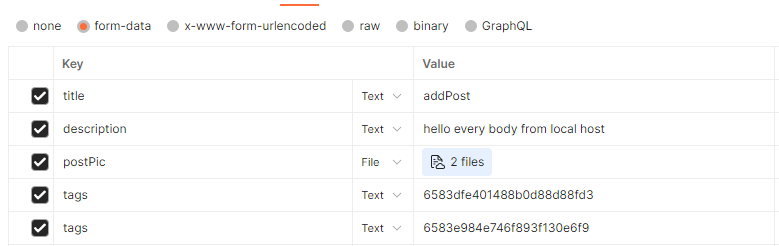
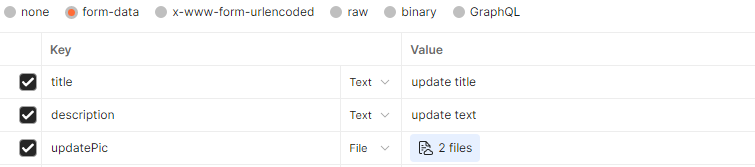

# Community
Community is API Social networking site, you can register and Login, add post or comment, delete post or comment, modify post or comment and reply comment. And to apply what I’m learn, I make this app Start with create server act as http and connection with database (MongoDB) by using mongoose then use hashing to hash password using bycyrbt package from NPM manager and crypt.js   to decode the phone number and how to deal with modules then make end point and make middleware to validation by using Joi, authorization ,using JWT to make decode to id to send him to header to allow you to make add or access to some end point ,end with sending email and add image by single or multiple and verify email of the user then how to upload this project to git hub and deal with deployment.Finaly this abbreviation and there are many details inside project 
</br>

## API Documentation
* *[user](#-1-user)
* *[post](#-2-post)
* *[report](#-3-report)

</br>

## # 1. user

### usermodel
| **Property** | **description** |
--- | --- |
|_id| Primary key.
|userName|The name of user.
|email| The email of user.
|password| The password of user.
|phone|The phone number of user.
|age| The age of user.
|gender|The gender of user.
|profilePick| Avatar of user.
|coverPick| Cover the main page of user.
|socialLinks| Social linkes of user.
|gallery| Gallery of user.
|story| Story of user.
|follower|Follower who is follow page of user.
|accountStatus| Account status of user.
|pdfLink|  Pdf attach.
|role| The user role.
|confirmed| check the user confirm or not.

</br>

### Users End Point
| **Endpoint** | **Method** |
--- | --- |
|/signUp|POST.
|/signIn|POST.
|/user/confirmed/:token|GET.
|/user/configration|PATCH.
|/admin/changeStatus/|POST.
|/user/follow/:id|PATCH.
|/user/profilePic|PATCH.
|/user/coverPick|PATCH.
|/user/gallery|PATCH.
|/user/story|PATCH.
|/user/likeStory/:id|PATCH.

### Json Format
* **/signUp** 
```json
{
    "email":"Elmancy@gmail.com",
    "password":"Password1$$",
    "cpassword":"Password1$$",
}
```
* **/signIn** 
```json
{
    "email":"Elmancy@gmail.com",
    "password":"Password1$$",
}
```

* **/user/story**
```json
  "text":"This story is nice"
```

* **user/configration**
```json
{
    "userName":"abdallah",
    "phone":"01007089283",
    "age":22,
    "gender":"male",
    "socialLinks":["https://www.facebook.com","https://www.x.com","https://www.instgram.com"]
}
```

* **admin/changeStatus/**
```json
{
    "id":"6583dfe401488b0d88d88fd3",
    "accountStatus":"block"
}
```


<div align="right">
    <b><a href="#API-Documentation">↥ back to top</a></b>
</div>

</br>

## # 2. post

### postModel
| **Property** | **description** |
--- | --- |
|_id| Primary key.
|title|Title of the post.
|description| Description of the post.
|images| Pictures link with the post.
|tags| array of tag some people.
|like| refer to how like the post
|comment| nested schema inside post.

### commentSchema
| **Property** | **description** |
--- | --- |
|_id| Primary key.
|description| Description of the post.
|tags| array of tag some people.
|like| refer to how like the post
|reply| nested schema inside post.

### replySchema
| **Property** | **description** |
--- | --- |
|_id| Primary key.
|description| Description of the post.
|tags| array of tag some people.
|like| refer to how like the post

### post End Point
| **Endpoint** | **Method** |
--- | --- |
|/post/addPost|POST.
|/post/deletePost/:id|DELETE.
|/post/updatePost/:id|Patch.
|/post/like/:id|Patch.
|/post/getAllpost|GET.
|/user/getAllpost|GET.
|/comment/addcomment|POST.

 </br>

### Json Format
* **post/addPost**


* **post/deletePost**
```js
"http://localhost:3000/post/deletePost/6589d6a919eb0ec63ce5a666"
```
* **post/updatePost**
```js
"http://localhost:3000/post/updatePost/6589db9438b77b33b5184c7f"
```


* **post/like**
```js
"http://localhost:3000/post/like/658b15aebf77e583bcd777ef"
```

* **comment/addComment**
```json
{
    "idPost":"658b15aebf77e583bcd777ef",
    "description":"hello from comment 22",
    "tags":["6583e984e746f893f130e6f9"]
}
```


<div align="right">
    <b><a href="#API-Documentation">↥ back to top</a></b>
</div>

</>


## Table of Contents

* *[express.js](#-1-expressjs)
* *[database](#-2-DataBase)
* *[middlewares](#-3-middlewares)
* *[controllers](#-4-controller)

</br>

## # 1. Expressjs
Express.js is framework for node Without Express JS, you must write your own code to create a routing component, which is time-consuming and labor-intensive. ExpressJS provides programmers with simplicity, flexibility, efficiency, minimalism, and scalability

I started create project so call express js and put listen to port I used dot env to hide port that's more secure

I used express.json beacuse parse incoming request (buffer) to json form data base

```js
const express = require("express")
const app = express()
require('dotenv').config()
const portListen = process.env.PORT
app.use(express.json())

app.listen(portListen,()=> console.log("work"))

```

<div align="right">
    <b><a href="#table-of-contents">↥ back to top</a></b>
</div>

</br>

## # 2. DataBase
I used NO-SQL Databse (mongooDB) by using mongoose package 

first I maked module of method to connect DataBase
```js
const  Mongoose  = require("mongoose");

const connectionDB = ()=>{
    Mongoose.connect(process.env.DATABASE)
    .then(()=>console.log("connect"))
    .catch(err=> console.log(err))
}

module.exports = connectionDB
```
then I called this method in app.js
```js
const express = require("express")
const connectionDB = require("./DB/DBConnection")
const app = express()
require('dotenv').config()

const portListen = process.env.PORT
connectionDB()

app.use(express.json())

app.listen(portListen,()=> console.log("work"))

```
after I checked with connection DB, I have made models

* **User MODEL** 

I have started to make sckema thats contain
```js
const { Schema, model } = require("mongoose");
const bcrypt = require("bcrypt")
const CryptoJS = require("crypto-js");

const userSchema = new Schema({
  userName: {
    type: String,
    trim: true
  },
  email: {
    type: String,
    unique: true,
    required: true,
    lowercase: true,
    trim: true,
  },
  password: {
    type: String,
    required: true,
  },
  phone: String,
  age: {
    type: Number,
    min: 18,
    max: 65,
  },
  gender: {
    type: String,
    default: "male",
  },
  profilePick: String,
  coverPick: [String],
  socialLinks: [ String ],
  gallery: Array,
  story: {
    text: { type: String, min: 100 },
    image: { type: [String] },
    likes: { type: [Schema.Types.ObjectId] },
  },
  follower: [Schema.Types.ObjectId],
  accountStatus: {type:String,default:"active"},
  pdfLink: String,
  role : {type:String,default:"user"},
  confirmed:{type:Schema.Types.Boolean,default:false}
});
```
and then maked hook to hash password and crypt phone number before the data save in collection

```js
userSchema.pre("validate",function(next){
  console.log(this.password);
    this.password = bcrypt.hashSync(this.password, parseInt(process.env.SALTROUND));
    this.phone = CryptoJS.AES.encrypt(this.phone, process.env.KEYCRYPT).toString();
    next()
})
```
finally maked model and export it
```js
const userCollection = model("user",userSchema)
module.exports = userCollection
```

* **POST MODEL**

after I had made user model , I Strated to make post

schema post thats contain nested schema of comment and nested shema of comment have to nested schema of reply
```js
const { Schema, model } = require("mongoose");
const replySchema = new Schema({
    description:{type:String,min:3,required:true},
    userID:{type:Schema.Types.ObjectId,required:true},
    tags:[Schema.Types.ObjectId],
    like:[Schema.Types.ObjectId],
})
const coomentSchema = new Schema({
    description:{type:String,min:3,required:true},
    userID:{type:Schema.Types.ObjectId,required:true},
    tags:[Schema.Types.ObjectId],
    like:[Schema.Types.ObjectId],
    reply:replySchema
})

const postSchema = new Schema({
    title:{type:String,min:3,max:32,required:true},
    description:{type:String,min:3,required:true},
    userID:{type:Schema.Types.ObjectId,required:true},
    tags:[Schema.Types.ObjectId],
    like:[Schema.Types.ObjectId],
    comment:coomentSchema,
})
```
finally maked model and export it 
```js
const postCollection = model("post",postSchema)

module.exports = postCollection
```

* **REPORT MODEL**
after I had finished from  make user and post model
I strted to make report model 

schema report model , model and export this model
```js
const { Schema , model } = require("mongoose");

const reportSchema = new Schema({
    title:String,
    reporter:Schema.Types.ObjectId,
    accountID:Schema.Types.ObjectId,
    postID:Schema.Types.ObjectId,
    massage:String,
    status:Schema.Types.Boolean
})

const reportCollection = model("report",reportSchema)
module.exports = reportCollection
```

<div align="right">
    <b><a href="#table-of-contents">↥ back to top</a></b>
</div>

</br>

## # 3.middlewares
* **valdationFunc**
It is middle ware function take schema of Joi and validate 
first loop with key of request body, params and query
then valid schema with req.key
if there no error will next
if error will message the error

```js
let headerKey = ['body','params','query']

const validationFunc = (schema)=>{
    return (req,res,next)=>{
        let errList = []
        headerKey.forEach( ele=>{
            if(schema[ele] != undefined){
                let valid = schema[ele].validate(req[ele])
                if(valid.error){
                    errList.push(valid.error)
                }
            }
        })
        if (errList.length > 0) {
            res.status(404).json({message:"validation error",errList})
        }else{
            next()
        }
    }
}

module.exports = validationFunc
```
</br>

* **authntication**
send end point contain role how can access to this route
if there is no token or false token will message erro
if not decode token and find user by id in the token
if user not exist show message error
if not make add object to request called user contain user -password
if role how is sent equl role of user then next
else error not permition

```js
const userCollection = require("../DB/models/user");
let jwt = require("jsonwebtoken");

const authorization = (roleUser) => {
  return async (req, res, next) => {
    try {
      let authorithationToken = req.headers["authorization"];
      if (!authorithationToken || !authorithationToken.startsWith("Bearer")) {
        res.status(404).json({ message: "invallid token" });
      } else {
        let token = authorithationToken.split(" ")[1];
        jwt.verify(token, process.env.TOKENKEY, async function (err, decode) {
          if (err) {
            res
              .status(404)
              .json({ message: " This is not correct token", err });
          } else {
            let user = await userCollection
              .findById(decode.id)
              .select("-password");
            if (!user) {
              res.status(404).json({ message: "user is nont exist" });
            } else {
              if (user.accountStatus == "active") {
                req.user = user;
                if (roleUser.includes(user.role)) {
                  next();
                } else {
                  res.status(404).json({ message: "you not allow to access" });
                }
              } else {
                res
                  .status(404)
                  .json({ messge: "You are blocked by community" });
              }
            }
          }
        });
      }
    } catch (error) {
      res.status(500).json({ message: "server error" });
    }
  };
};
module.exports = authorization;

```

</br>

* **Cors**
Middleware function that allaw cors option to recieve data from him 

First I make opject module allaw to all this in test stage only
```js
const corsOptional ={
    origin: "*",
    optionsSuccessStatus
}

module.exports = corsOptional
```

then I call function call in app js has parmeter corsOptional

<div align="right">
    <b><a href="#table-of-contents">↥ back to top</a></b>
</div>

</br>


## # 4. Controller

### User controllers
* **signUp**
take email ,password  from request.body 
check by email if user exist 
if user exist error massage user is exist
if not make new instance from userCollection then save it , message data user then 
send message to email which sign by it to cinfirmed email

```js
const jwt= require("jsonwebtoken")
const userCollection = require("../../../DB/models/user")
const sendMessage = require("../../../public/functions/sendMessage")

const signUp = async(req,res)=>{
   try {
    let {email,password}= req.body
    let findUser = await userCollection.findOne({email:email})
    if(findUser){
        res.status(404).json({message:"user exist"})
    }else{
            let addUser = new userCollection({email,password})
            let saveUser = await addUser.save()
            let token = jwt.sign({email:email},process.env.TOKENKEY,{ expiresIn: 60 * 60 })
            let refreshToken = jwt.sign({email:email},process.env.TOKENKEY)
            let tokenURL = `<a href= '${req.protocol}://${req.headers.host}/user/confirmed/${token}'>confirmed password</a>
            <a href= '${req.protocol}://${req.headers.host}/user/confirmed/${refreshToken}'>refresh password</a>
            `
            sendMessage(tokenURL,email)
            res.status(200).json({message:"success add",saveUser})
    }
   } catch (error) {
    res.status(505).json({message:error})
   }
}
module.exports = signUp
```
</br>

* **signIn**
take email ,password  from request.body 
check by email if user exist 
if user exist error massage user is exist
if not  check user if active or not
if make token contain id user and message it

```js
const userCollection = require("../../../DB/models/user")
const jwt = require("jsonwebtoken")
const bcrypt = require("bcrypt")

const signIn = async(req,res)=>{
    try {
        let {email,password}= req.body
        let findUser = await userCollection.findOne({email:email})
        if(findUser){
           if(findUser.accountStatus == "active"){
            let decodePassword = await bcrypt.compare(password,findUser.password)
            if (decodePassword == true) {
                let sendToken = jwt.sign({id:findUser._id},process.env.TOKENKEY,{expiresIn:'7d'})
                res.status(201).json({message:"Welcom to commmuntiy",Token:sendToken})
            }else{
                res.status(404).json({message:"Password or user is wrong "})
            }
           }else{
            res.status(404).json({messge : "You are blocked by community"})
           }
        }else{
            res.status(404).json({message:"user is not exist"})
        }
    } catch (error) {
        res.status(505).json({message:error})
    }
}

module.exports= signIn
```
</br>

* **confirmed**
take token from params 
and decode this token if you find user
check This user has confirmed or not
if confirm send massage ref to user is confirm
if not update user and make confirm is true
if user not exist send massage uer is not exist

```js
const userCollection = require("../../../DB/models/user")
const jwt = require("jsonwebtoken")

const confirmed = async(req,res)=>{
   try {
    let token = req.params.token
    let decodeToken = jwt.verify(token,process.env.TOKENKEY)
    let findUser = await userCollection.findOne({email:decodeToken.email})
    if(findUser){
        if(findUser.confirmed == false){
            let updateConfirm = await userCollection.findOneAndUpdate({email:findUser.email},{confirmed:true},{new:true})
            res.status(201).json({message:' User have confirmed',updateConfirm})
        }else{
            res.status(404).json({message:"User was confirmed"})
        }
    }else{
        res.status(404).json({message:"User is not exist"})
    }
   } catch (error) {
    res.status(500).json({message:"server error",error})
   }
}

module.exports = confirmed
```


</br>

* **sendMessage**

```js
const nodemailer = require("nodemailer");
const sendMessage = async(message,email)=>{
    const transporter = nodemailer.createTransport({
        service: "gmail",
        port: 465,
        secure: true,
        auth: {
          // TODO: replace `user` and `pass` values from <https://forwardemail.net>
          user: process.env.EMAILSEND,
          pass: process.env.PASSWORD,
        },
      });
      
      // async..await is not allowed in global scope, must use a wrapper
  
        // send mail with defined transport object
        const info = await transporter.sendMail({
          from: '"Abdalluh Elmancy" <process.env.EMAILSEND>', // sender address
          to: email, // list of receivers
          subject: "Confirmed account", // Subject line
          text: "click the link to verify your acount", // plain text body
          html: message
        });
}
module.exports = sendMessage
```
</br>

* **accountStatus**
I taked id and account status and update status 
```js
const userCollection = require("../../../DB/models/user")

const accountStatusF = async(req,res)=>{
    try {
        let {id,accountStatus} = req.body
        await userCollection.findByIdAndUpdate(id,{accountStatus})
        res.status(200).json({message:"Account status update"})
    } catch (error) {
        res.status(500).json({message:"server error"})
    }
}
module.exports = accountStatusF
```

</br>

* **configration**
I take userName ,phone ,age ,gender and socialLinks
then find the user by id take from authroiztion middle ware then update 

```js
const userCollection = require("../../../DB/models/user")
const configrationUSer =async(req,res)=>{
    try {
        let {userName,phone,age,gender,socialLinks} = req.body
        await userCollection.findByIdAndUpdate(req.user._id,{userName,phone,age,gender,socialLinks})
        res.status(201).json({message:"successful update"})
    
    } catch (error) {
        res.status(500).json({message:"server error"})
    }
}
module.exports = configrationUSer
```

</br>

* **followers**
I Take Id user who will follow it from params
then check user exist or not
if user exist ,I will check if that user is active or not 
if active I will push myid (user id) to user if actually you follow will massage you follow this us
if this user is nont active I will give massage user is block
if user is not exist , I will give massage user is not exist
```js
const userCollection = require("../../../DB/models/user");

const followers = async (req, res) => {
  try {
    const id = req.params.id;
    const findUser = await userCollection.findById(id);
    if (findUser) {
      if (findUser.accountStatus == "active") {
        let checkUserFollow = findUser.follower.find(
          (ele) => ele.toString() == req.user._id
        );
        if (checkUserFollow == undefined) {
          findUser.follower.push(req.user._id);
          await userCollection.findByIdAndUpdate(id, {
            follower: findUser.follower,
          });
          res.status(201).json({ message: "successful follow" });
        } else {
          res.status(404).json({ message: "You followed this user" });
        }
      } else {
        res.status(404).json({ message: " This user is blocked" });
      }
    } else {
      res.status(404).json({ message: " This user is not exist" });
    }
  } catch (error) {
    res.status(404).json({ message: "Server error", error });
  }
};

module.exports = followers;

```
</br>

* **profilePick**

I check file exist update profile Image
if file not exist will give massge Avatr is not exist
```js
const userCollection = require("../../../DB/models/user")
const profilePick = async(req,res)=>{ 
      try {
        if(req.file){
            const imageURL =`${req.protocol}://${req.headers.host}/${req.file.path}`
            const updateImage = await userCollection.findByIdAndUpdate(req.user._id,{profilePick:imageURL},{new:true})
            res.status(200).json({message:"Profile picture update",image: updateImage.profilePick})
    
        }else{
            res.status(404).json({message:"Avatr is not exist"})
        }
      } catch (error) {
        res.status(505).json({message:"Server error",error})
      }
}
```
</br>

* **coverPick**
check if files exist loop with file to create url image and update coverPic
if files not exis will give cover is not exist
```js
const coverPick = async(req,res)=>{   
try {
    if(req.files){
        let allPick =[]
        for (let index = 0; index < req.files.length; index++) {
            let imageURL =`${req.protocol}://${req.headers.host}/${req.files[index].path}`
            allPick.push(imageURL)
         }
        const updateImage = await userCollection.findByIdAndUpdate(req.user._id,{coverPick:allPick},{new:true})
        res.status(200).json({message:"Profile cover pictures update",image: updateImage.coverPick})

    }else{
        res.status(404).json({message:"cover is not exist"})
    }
} catch (error) {
    res.status(505).json({message:"Server error",error})
}
}
```
</br>

* **gallery**

check if files exist loop with file to create url image and push to user coverPic
then update this user if not gallery is not exist
```js
const userCollection = require("../../../DB/models/user")
const gallery = async(req,res)=>{   
   try {
    if(req.files){     
        for (let index = 0; index < req.files.length; index++) {
            let imageURL =`${req.protocol}://${req.headers.host}/${req.files[index].path}`
            req.user.gallery.push(imageURL)
         }
        const updateImage = await userCollection.findByIdAndUpdate(req.user._id,{gallery:req.user.gallery},{new:true})
        res.status(200).json({message:"gallery pictures update",image: updateImage.gallery})

    }else{
        res.status(404).json({message:"gallery is not exist"})
    }
   } catch (error) {
    res.status(505).json({message:"Server error",error})
   }
}

module.exports = gallery
```
</br>

* **story**
story may be text or image 
when image check ther is file 
if file exist will update file
if not check the is text if text will update
if not will give massge invlid user
```js
const userCollection = require("../../../DB/models/user");

const story = async (req, res) => {
  try {
    if (req.file != undefined) {
      const imageURL = `${req.protocol}://${req.headers.host}/${req.file.path}`;
      if (!req.user.story) {
        let objectStory = {
          image: imageURL,
        };
        const updateImage = await userCollection.findByIdAndUpdate(
          req.user._id,
          { story: objectStory },
          { new: true }
        );
        res
          .status(200)
          .json({ message: "story update", image: updateImage.story });
      } else {
        req.user.story.image = imageURL;
        const updateImage = await userCollection.findByIdAndUpdate(
          req.user._id,
          { story: req.user.story },
          { new: true }
        );
        res
          .status(200)
          .json({ message: "story update", image: updateImage.story });
      }
    } else if (req.body.text) {
      const { text } = req.body;
      if (!req.user.story) {
        let objectStory = {
          text: text,
        };
        const updateText = await userCollection.findByIdAndUpdate(
          req.user._id,
          { story: objectStory },
          { new: true }
        );
        res
          .status(200)
          .json({ message: "story update", text: updateText.story });
      } else {
        req.user.story.text = text;
        const updateText = await userCollection.findByIdAndUpdate(
          req.user._id,
          { story: req.user.story },
          { new: true }
        );
        res
          .status(200)
          .json({ message: "story update", text: updateText.story });
      }
    } else {
      res.status(404).json("invalid story");
    }
  } catch (error) {
    res.status(505).json({message:"Server error",error})
  }
};
module.exports = story;

```
</br>

* **likeStory**

I Take id user params who have story
then check user is exist or not exist
if exist check the story if exist or not
if exist story ckeck id you like it befor or not
st
```js
const userCollection = require("../../../DB/models/user");

const likeStory = async(req,res)=>{
   try {
    let {id} = req.params
    let findUser = await userCollection.findById(id)
    if(findUser){
        if(findUser.story){
            if (findUser.story.likes.includes(req.user._id)) {
                res.status(404).json({message:"You liked this story before"})
            }else{
                findUser.story.likes.push(req.user._id)
                let updateLike = await userCollection.findByIdAndUpdate(id,{story:findUser.story},{new:true})
                res.status(201).json({message:"User liked this story",story: updateLike.story})
            }
           
        }else{
            res.status(404).json({message:"That is not story"})
        }
    }else{
        res.status(404).json({message:" user is not exist"})
    }
   } catch (error) {
    res.status(505).json({message:"Server error",error})

   }
}
module.exports = likeStory
```


<div align="right">
    <b><a href="#table-of-contents">↥ back to top</a></b>
</div>

</br>

### post Controller

* **addpost**

First take request from body (form-data)
if I find files ,I loop this file and make url of wach file
and push them in array all pick
then if post have tags ,I loop with this tags to find user exist or not if valid
will push it in array valid tags and fill tag email who user is send wmail 
to make his know that some one tag him.
then call function sendEmails and fill it and create po

```js
const postCollection = require("../../../DB/models/post");
const userCollection = require("../../../DB/models/user");
const sendMessage = require("../../../public/functions/sendMessage");

const addPost = async(req,res)=>{
try {
    let {title,description,tags}= req.body
    let allPic = []
    let validTags = []
    let tagEmail = ""
    
    if(req.files){
        for (let index = 0; index < req.files.length; index++) {
            let imageURL = `${req.protocol}://${req.headers.host}/${req.files[index].path}`
            allPic.push(imageURL)
        }
    }
    if(tags.length != 0){
        for (let index = 0; index < tags.length; index++) {
            let findUser = await userCollection.findById(tags[index])
            if(findUser){
                validTags.push(tags[index])
                if(validTags){
                    tagEmail += tagEmail + ", " + findUser.email
                }else{
                    tagEmail = findUser.email
                }
            }
        }
    }

    sendMessage(` You tage by ${req.user.email}`,tagEmail)
    let addPost = new postCollection({title,description,tags:validTags,userID:req.user._id,images:allPic})
    let savePost = await addPost.save()
    res.status(200).json({message:"post successful",savePost})
} catch (error) {
    res.status(505).json({message:"server error"})
}
}

module.exports = addPost
```
</br>

* **deletePost**
Take id of post which its delete in params
then check if post is exxist or not
if exist will will check if user id who will delete
the post the same with create this post
if yes will delte post.
```js
const postCollection = require("../../../DB/models/post")

const deletePost = async(req,res)=>{
  try {
    let {id} = req.params
    let findPost = await postCollection.findById(id)
    if(findPost){
        if(findPost.userID.toString() == req.user._id){
            await postCollection.deleteOne({_id:id})
            res.status(200).json({message:"The post has been successfully deleted"})
        }else{
            res.status(404).json({message:"you don't allow delte this post"})
        }
    }else{
        res.status(404).json({message:"post isn't exist"})
    }
  } catch (error) {
    res.status(505).json({message:"server error",error})
  }
}
module.exports = deletePost
```

</br>

* **updatePost**
take post id from params 
check post is exist or not
if exist check files exist or not
if files will loop in it and make url and push them in array
and update post
if files not update post without files
```js
const postCollection = require("../../../DB/models/post");

const updatePost = async(req,res)=>{
try {
    let {id} = req.params
    let findPost = await postCollection.findById(id)
    if(findPost){
        if(findPost.userID.toString() == req.user._id){
            let updateOldPost;
            let {title,description}= req.body
            let allPic = []
            if(req.files.length > 0){
                for (let index = 0; index < req.files.length; index++) {
                    let imageURL = `${req.protocol}://${req.headers.host}/${req.files[index].path}`
                    allPic.push(imageURL)
                }
                updateOldPost = await postCollection.findByIdAndUpdate(id,{title,description,images:allPic},{new:true})
            }else{
                updateOldPost = await postCollection.findByIdAndUpdate(id,{title,description},{new:true})
            }
            res.status(200).json({message:"post has been update",updateOldPost})
        }else{
            res.status(404).json({message:"you don't allow delte this post"})
        }
    }else{
        res.status(404).json({message:"post isn't exist"})
    }
} catch (error) {
    res.status(505).json({message:"server error"})
}
}

module.exports = updatePost
```
</br>

* **likePost**
take post id from params
check if post is exist or not
if exist check if this user is like to this post or not
if not push id user and update like from post model
```js
const postCollection = require("../../../DB/models/post");

const likePost  = async(req,res)=>{
   try {
    let {id} = req.params
    let findPost = await postCollection.findOne({_id:id})
    if(findPost){
        if(findPost.like.includes(req.user._id)){
            res.status(404).json({message:"You liked it before"})
        }else{
            findPost.like.push(req.user._id)
            let updatePost = await postCollection.findByIdAndUpdate(id,{like:findPost.like},{new:true})
            res.status(200).json({message:"successfull like",updatePost})
        }
    }else{
        res.status(404).json({message:"post not exist"})
    }
   } catch (error) {
    res.status(505).json({message:"Server error",error})
   }
}
module.exports = likePost
```
</br>

* **getAllPost**
Here we make pagination by take page and limit from query
and return specfic number of post
```js
const postCollection = require("../../../DB/models/post");

const getAllPost = async(req,res)=>{
try {
    let {page,limit}= req.query
    if(!page){
        page = 1
    }
    if(!limit){
        limit = 4
    }
    let skipItem = (page -1) * limit
    let findPost = await postCollection.find({}).select("-password").limit(limit).skip(skipItem)
    res.status(200).json({message:"allPost",findPost})
} catch (error) {
    res.status(505).json({message:"Server error",error})
}

}
module.exports = getAllPost
```

</br>

* **getUserPost**
Here get all user post
```js
const postCollection = require("../../../DB/models/post");

const getUserPosts = async(req,res)=>{
try {
    let {page,limit}= req.query
    if(!page){
        page = 1
    }
    if(!limit){
        limit = 4
    }
    let skipItem = (page -1) * limit
    let findPost = await postCollection.find({userID:req.user._id}).select("-password").limit(limit).skip(skipItem)
    res.status(200).json({message:"allPost",findPost})
} catch (error) {
    res.status(505).json({message:"Server error",error})
}

}
module.exports = getUserPosts
```
<div align="right">
    <b><a href="#table-of-contents">↥ back to top</a></b>
</div>

</br>

### comment Controller
* **addComment**
take request from body
check post is exist by id which send by id in body
if exist check if comment have tag 
if tags loop these tags and check id valid 
do the same what do in add post
then create comment
```js
const postCollection = require("../../../DB/models/post");
const userCollection = require("../../../DB/models/user");
const sendMessage = require("../../../public/functions/sendMessage");

const addComment = async(req,res)=>{
  try {
    let {idPost,tags,description} = req.body
    let findPost = await postCollection.findById(idPost)
    if(findPost){
        let validTags = []
        let tagEmail = ""    
        if(tags.length != 0){
            for (let index = 0; index < tags.length; index++) {
                let findUser = await userCollection.findById(tags[index])
                if(findUser){   
                    validTags.push(tags[index])
                    if(validTags){
                        tagEmail += tagEmail + ", " + findUser.email
                    }else{
                        tagEmail = findUser.email
                    }
                }
            }
        }
        sendMessage(` You tage by ${req.user.email}`,tagEmail)
        findPost.comment.push({description,tags:validTags,userID:req.user._id})
        let addComment = await postCollection.findByIdAndUpdate(findPost._id,{comment:findPost.comment},{new:true})
        res.status(201).json({message:"Successful add",addComment})
    }else{
        res.status(404).json({message:"Post is not exist"})
    }
  } catch (error) {
    res.status(505).json({message:"server error",error})
  }
}

module.exports = addComment
```

<div align="right">
    <b><a href="#table-of-contents">↥ back to top</a></b>
</div>

</br>